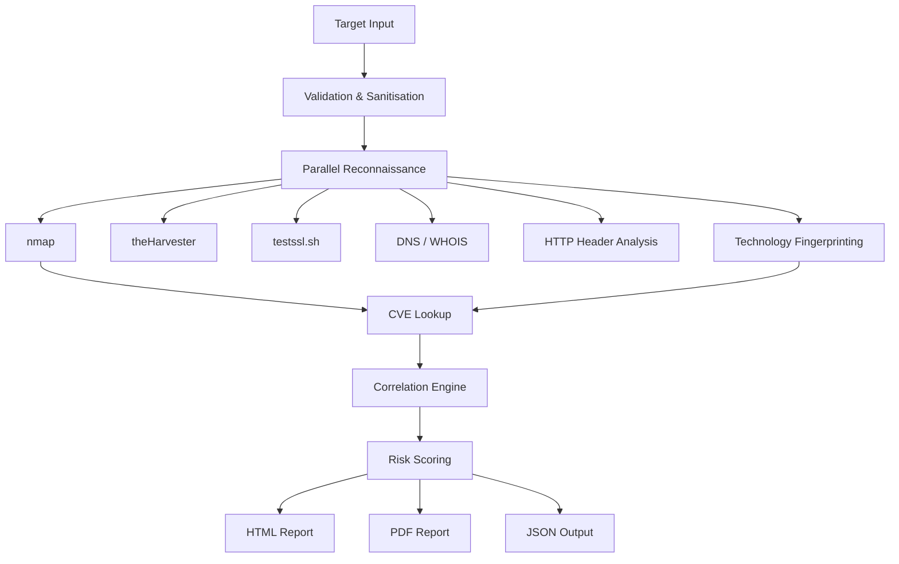

<div align="center">

# ThreatLens 🔍

## Vulnerability Assessment & Security Validation Platform


</div>

ThreatLens is a modular Python cybersecurity platform that combines **reconnaissance, vulnerability intelligence, risk assessment, automated reporting, and CI/CD security validation**.

The project has two connected layers:

- **Assessment pipeline:** authorised target reconnaissance, service and technology discovery, CVE enrichment, cross-tool correlation, risk scoring, and reporting.
- **Security validation pipeline:** dependency scanning with `pip-audit`, CVE enrichment with CVSS/EPSS/CISA KEV intelligence, deterministic risk classification, and a policy-based security gate in GitHub Actions.

> **Engineering goal:** build a lightweight vulnerability assessment and security validation workflow using open-source tooling, public vulnerability intelligence, and deterministic security policies.

---

## 🛡️ What ThreatLens Does

### 1. Authorised Security Assessment

ThreatLens accepts a domain or IP address and orchestrates multiple security checks:

1. Validates and sanitises the target input.
2. Runs reconnaissance and security checks in parallel.
3. Discovers services, versions, DNS information, exposed technology, and HTTP/TLS configuration.
4. Enriches discovered version information with CVE data from the NVD API.
5. Correlates findings across tools using 11 threat patterns.
6. Calculates a weighted risk score from 0–100.
7. Generates structured PDF, HTML, JSON, and terminal reports.

### 2. CI/CD Security Validation

The newer security pipeline evaluates the project's own Python dependencies before changes are accepted:

```text
requirements.txt
      │
      ▼
  pip-audit
      │
      ▼
 SCA findings
      │
      ▼
 CVE enrichment
 ┌────┼───────────────┐
 ▼    ▼               ▼
CVSS EPSS          CISA KEV
 └────┼───────────────┘
      ▼
Deterministic risk tier
      │
      ▼
 Security Policy Gate
      │
   PASS / FAIL
```

The pipeline records vulnerability-intelligence failures explicitly rather than silently treating missing data as clean.

---

## ⚙️ Security Gate Policy

The security gate is implemented in `scripts/security_gate.py` and performs **no network calls**. It evaluates the enriched report against explicit policy thresholds.

Current policy:

| Condition | Result |
|---|---|
| CRITICAL findings > 0 | FAIL |
| HIGH findings > 3 | FAIL |
| Any CISA KEV-listed finding | FAIL |
| Partial vulnerability-intelligence enrichment | FAIL |
| No policy violation | PASS |

The policy can be adjusted through environment variables:

- `MAX_CRITICAL`
- `MAX_HIGH`
- `FAIL_ON_KEV`

The intelligence enrichment stage in `scripts/vuln_intel.py` uses:

- **NVD** for CVSS data
- **FIRST EPSS** for exploitation probability signals
- **CISA KEV** for known exploited vulnerabilities

KEV status takes precedence over the numerical CVSS/EPSS model.

---

## 🚀 Quick Start

### Clone and install

```bash
git clone https://github.com/Alisha-chaudhary/ThreatLens.git
cd ThreatLens

python3 -m venv .venv
source .venv/bin/activate

pip install -r requirements.txt
```

### Verify external tools

```bash
nmap --version
theHarvester --version
testssl.sh --version
```

### Run the assessment pipeline

```bash
python main.py
```

ThreatLens will prompt for a target:

```text
Enter target (domain/IP): scanme.nmap.org
```

---

## 🧪 Validation & CI/CD

GitHub Actions runs the security pipeline on:

- pushes to `main`
- pushes to `feature/security-gate-pipeline`
- pull requests targeting `main`
- manual workflow dispatch

The workflow uses **Python 3.13** and is organised into these stages:

| Stage | Purpose |
|---|---|
| Tests | Runs the automated validation suite |
| SCA | Scans project dependencies with `pip-audit` |
| Vulnerability Intelligence | Enriches CVEs with CVSS, EPSS, and CISA KEV data |
| Security Gate | Applies deterministic security policy and returns PASS/FAIL |

Key workflow file:

```text
.github/workflows/security-pipeline.yml
```

Run the validation suite locally:

```bash
python -m pytest test_validation.py -v
```

---

## 🧩 Project Structure

```text
ThreatLens/
├── main.py
├── modules/
│   ├── scanner.py
│   ├── osint.py
│   ├── misconfig.py
│   ├── headers.py
│   ├── dns_whois.py
│   ├── fingerprint.py
│   ├── cve_lookup.py
│   ├── correlation.py
│   ├── scoring.py
│   └── parallel_runner.py
│
├── scripts/
│   ├── vuln_intel.py
│   └── security_gate.py
│
├── reports/
│   ├── report_generator.py
│   ├── pdf_generator.py
│   └── terminal_output.py
│
├── utils/
│   └── validation.py
│
├── output/
│   ├── report.html
│   ├── report.pdf
│   └── raw_results.json
│
├── test_validation.py
├── requirements.txt
└── .github/
    └── workflows/
        └── security-pipeline.yml
```

---

## 🏗️ Assessment Architecture



Most reconnaissance modules run concurrently using `ThreadPoolExecutor`. CVE lookup follows discovery because it depends on service and version information identified during reconnaissance.

---

## 🔎 Core Assessment Modules

| Module | Purpose |
|---|---|
| **OSINT** | Subdomains, emails, and IP information via theHarvester |
| **Port Scanner** | Open ports, services, and versions via nmap |
| **SSL/TLS** | Protocol, certificate, and configuration analysis via testssl.sh |
| **Header Checker** | HTTP security-header inspection |
| **DNS / WHOIS** | DNS records, SPF, DMARC, DKIM, and WHOIS information |
| **Technology Fingerprinting** | CMS, frameworks, and server technology discovery |
| **CVE Lookup** | NVD CVE enrichment based on discovered versions |
| **Correlation Engine** | 11 cross-tool threat patterns |
| **Risk Scoring** | Weighted assessment score capped at 100 |
| **Report Generator** | PDF, HTML, JSON, and Rich terminal output |

---

## 🔗 Correlation Patterns

ThreatLens correlates observations from multiple assessment modules rather than treating every finding in isolation.

Examples include:

| Pattern | Sources | Severity |
|---|---|---|
| Exposed admin port | nmap | High |
| Weak SSL + open HTTPS | nmap + testssl | High |
| Emails + subdomains exposed | theHarvester | Medium |
| Unencrypted service + sensitive port | nmap | High |
| Certificate trust issue + live HTTPS | testssl + nmap | Medium |
| Poor headers + HTTP open | headers + nmap | High |
| Young domain + email exposure | WHOIS + OSINT | Critical |
| No SPF + No DMARC | DNS | Critical |
| CMS detected + many open ports | fingerprint + nmap | High |
| Server version exposed + weak SSL | fingerprint + testssl | High |
| Critical CVE + exposed service | NVD + nmap | Critical |

---

## 📊 Assessment Risk Scoring

| Score | Severity |
|---|---|
| 75–100 | Critical |
| 50–74 | High |
| 25–49 | Medium |
| 0–24 | Low |

Severity weights:

- Critical = 40 points
- High = 25 points
- Medium = 15 points
- Low = 5 points

The final assessment score is capped at 100.

**Important:** a finding's presence does not automatically represent the same level of real-world risk in every environment. Context, exposure, configuration, compensating controls, and exploitability still matter.

---

## 📁 Assessment Output

After a scan, ThreatLens can generate:

| Output | Purpose |
|---|---|
| `report.pdf` | Structured security assessment report |
| `report.html` | Browser-viewable report |
| `raw_results.json` | Machine-readable assessment data |

The CI/CD workflow separately produces `sca-results.json` and `risk-report.json` as GitHub Actions artifacts.

---

## 🛠️ Built With

- **Python**
- **ThreadPoolExecutor** for parallel execution
- **nmap** for service and port discovery
- **theHarvester** for OSINT collection
- **testssl.sh** for SSL/TLS analysis
- **dnspython** for DNS queries
- **python-whois** for WHOIS information
- **requests** for HTTP/API communication
- **NVD API** for CVE intelligence
- **FIRST EPSS** for exploitation-probability data
- **CISA KEV** for known exploited vulnerabilities
- **pip-audit** for Python dependency vulnerability scanning
- **ReportLab** for PDF reporting
- **Rich** for terminal output
- **GitHub Actions** for automated security validation

---

## 🧠 Engineering Concepts

ThreatLens was built incrementally to explore practical cybersecurity engineering concepts, including:

- Input validation and shell-injection prevention
- Subprocess management and output parsing
- XML parsing of nmap results
- Parallel execution with `ThreadPoolExecutor`
- DNS record analysis
- HTTP security headers
- SSL/TLS configuration analysis
- CVE and vulnerability intelligence enrichment
- CVSS and EPSS-based risk signals
- CISA KEV awareness
- Deterministic security policy enforcement
- Software Composition Analysis (SCA)
- Automated testing and CI/CD security controls
- PDF and HTML security reporting

---

## ⚖️ Authorised Testing Only

ThreatLens is intended for **authorised security testing, defensive research, and educational use**.

Only scan systems you own or have explicit permission to assess. The author is not responsible for misuse of the project.

For safe demonstrations, use deliberately authorised targets such as:

| Target | Purpose |
|---|---|
| `scanme.nmap.org` | Nmap-authorised scanning target |
| `testphp.vulnweb.com` | Deliberately vulnerable test application |
| `http.badssl.com` | TLS and HTTP testing |

---

## 📄 License

This project is licensed under the MIT License.

---

## 🧭 Roadmap

- [ ] Docker support
- [ ] CLI arguments
- [ ] Async scanning engine
- [ ] Multi-target scanning
- [ ] Shodan integration
- [ ] Web dashboard
- [ ] SIEM export support
- [ ] CI/CD security policy expansion

---

**Built by Alisha-chaudhary**
