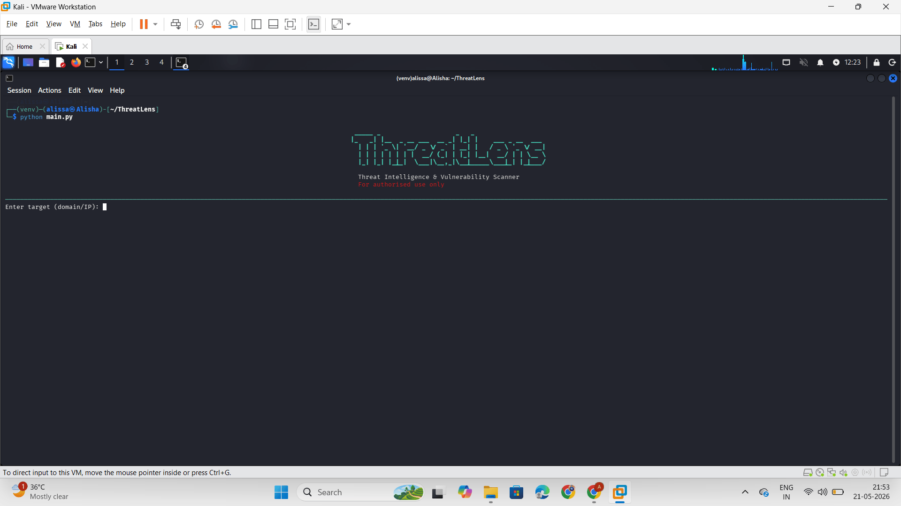
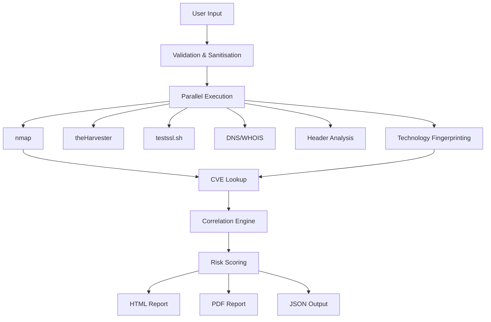

<div align = "center">
    
# ThreatLens 🔍
### Threat Intelligence & Vulnerability Scanner




</div>

> A modular, professional-grade security reconnaissance tool built in Python.

It was created to answer a simple question:
> What would a lightweight enterprise-style security assessment pipeline look like if I built it from scratch?

The project combines OSINT gathering, service enumeration, SSL/TLS analysis, DNS inspection, technology fingerprinting, CVE enrichment, and threat correlation into a single automated workflow.

Instead of running multiple tools manually and stitching results together by hand, ThreatLens orchestrates everything in parallel and produces structured reports with risk scoring and contextual findings.


---
## 🛠️ Built for:

- cybersecurity learning
- authorised security assessments
- defensive research
- portfolio and engineering practice

## 🚀 What it does

ThreatLens takes a domain or IP address and runs a full security assessment automatically:

1. **Validates and sanitises** the input against shell injection
2. **Runs 6 scans in parallel** - nmap, theHarvester, testssl, header checker, DNS/WHOIS, fingerprinting
3. **Runs CVE lookup** against the NVD database using discovered version info
4. **Correlates findings** across all tools using 11 cross-tool threat patterns
5. **Calculates a risk score** out of 100 with severity breakdown
6. **Generates reports** - Rich terminal UI, PDF, HTML, and raw JSON

## ⚡ Quick Start

```bash
git clone https://github.com/Alisha-chaudhary/ThreatLens.git

cd ThreatLens

python3 -m venv venv
source venv/bin/activate

pip install -r requirements.txt

python main.py
```
---
## ⚡ Features

- Parallel multi-tool scanning pipeline
- OSINT intelligence gathering
- Port and service enumeration
- SSL/TLS certificate and protocol analysis
- HTTP security header inspection
- DNS, SPF, DKIM, and DMARC validation
- Technology fingerprinting and CMS detection
- CVE enrichment using the NVD API
- Cross-tool threat correlation engine
- Weighted risk scoring system
- PDF, HTML, JSON, and Rich terminal reporting

---

## 🧩 Project Structure

```
ThreatLens/
├── main.py                      # Entry point — orchestrates the pipeline
├── modules/
│   ├── scanner.py               # nmap port scanner
│   ├── osint.py                 # theHarvester OSINT
│   ├── misconfig.py             # testssl SSL/TLS check
│   ├── headers.py               # HTTP security header checker
│   ├── dns_whois.py             # SPF, DMARC, DKIM, WHOIS
│   ├── fingerprint.py           # CMS and tech fingerprinting
│   ├── cve_lookup.py            # NVD CVE lookup
│   ├── correlation.py           # Cross-tool threat correlation
│   ├── scoring.py               # Risk scoring engine
│   └── parallel_runner.py       # ThreadPoolExecutor parallel runner
├── reports/
│   ├── report_generator.py      # HTML report
│   ├── pdf_generator.py         # PDF report (ReportLab)
│   └── terminal_output.py       # Rich terminal UI
├── utils/
│   └── validation.py            # Input validation and sanitisation
├── output/                      # Generated reports saved here
│   ├── report.html
│   ├── report.pdf
│   └── raw_results.json
└── tests/
    └── test_validation.py
```


## 🏗️ Architecture


ThreatLens runs most scans concurrently using ThreadPoolExecutor, reducing overall execution time while keeping modules independent and extensible.

The CVE lookup stage runs afterward because it depends on service and version information discovered during scanning.


---

## ⚙️ Installation

### Requirements

- Python 3.10+
- Kali Linux or any Linux distro
- nmap
- theHarvester
- testssl.sh

### Setup

```bash
# Clone the repository
git clone https://github.com/Alisha-chaudhary/ThreatLens.git
cd ThreatLens

# Create and activate virtual environment
python3 -m venv venv
source venv/bin/activate

# Install dependencies
pip install -r requirements.txt

# Verify external tools are installed
nmap --version
theHarvester --version
testssl.sh --version
```

---

## Usage

```bash
# Activate venv first (every new terminal session)
source venv/bin/activate

# Run the scanner
python main.py

# Enter target when prompted
Enter target (domain/IP): scanme.nmap.org
```

### Legal test targets

| Target | Purpose |
|---|---|
| `scanme.nmap.org` | Maintained by nmap team — explicitly permitted |
| `testphp.vulnweb.com` | Acunetix test site — deliberately vulnerable |
| `http.badssl.com` | SSL/header testing — publicly available |

> ⚠️ **Only scan targets you own or have explicit written permission to scan.**  
> Unauthorised scanning is illegal in most jurisdictions.

---
## Core Modules

| Module                   | What it checks                                                    |
|--------------------------|-------------------------------------------------------------------|
| **OSINT**                | Subdomains, emails, IP addresses via theHarvester                 |
| **Port Scanner**         | Open ports, services, versions via nmap                           |
| **SSL/TLS**              | Weak protocols, POODLE, HEARTBLEED, cert expiry via testssl       |
| **Header Checker**       | CSP, HSTS, X-Frame-Options, leaky server headers                  |
| **DNS / WHOIS**          | SPF, DMARC, DKIM, domain age, registrar info                      |
| **Tech Fingerprinting**  | CMS (WordPress, Joomla, Drupal), frameworks, server software      |
| **CVE Lookup**           | Queries NVD API for CVEs matching discovered versions             |
| **Correlation Engine**   | 11 cross-tool patterns (e.g. weak SSL + open HTTPS = active risk) |
| **Risk Scoring**         | Weighted severity scoring, capped at 100                          |
| **Report Generator**     | PDF (ReportLab), HTML, JSON, Rich terminal summary                |

---
## 📁 Output

After each scan the following files are saved to `output/`:

| File               | Format | Purpose                               |
|--------------------|--------|---------------------------------------|
| `report.pdf`       | PDF    | Professional client-ready report      |
| `report.html`      | HTML   | Open in browser for full styled view  |
| `raw_results.json` | JSON   | Machine-readable data for integration |

---

## Correlation Patterns

The correlation engine detects combined threats that no single tool can catch alone:

| Pattern                              | Tools Combined          | Severity |
|--------------------------------------|-------------------------|----------|
| Exposed admin port                   | nmap                    | High     |
| Weak SSL + open HTTPS                | nmap + testssl          | High     |
| Emails + subdomains exposed          | theHarvester            | Medium   |
| Unencrypted service + sensitive port | nmap                    | High     |
| Cert trust issue + live HTTPS        | testssl + nmap          | Medium   |
| Poor headers + HTTP open             | headers + nmap          | High     |
| Young domain + email exposure        | whois + osint           | Critical |
| No SPF + No DMARC                    | dns                     | Critical |
| CMS detected + many open ports       | fingerprint + nmap      | High     |
| Server version exposed + weak SSL    | fingerprint + testssl   | High     |
| Critical CVE + exposed service       | nvd + nmap              | Critical |

---

## 📊 Risk Scoring

| Score     | Severity  |
|-----------|-----------|
| 75 – 100  | Critical  |
| 50 – 74   | High      |
| 25 – 49   | Medium    |
| 0 – 24    | Low       |

Severity weights: Critical = 40pts, High = 25pts, Medium = 15pts, Low = 5pts  
Final score is capped at 100.

---

## Built with

- Python 3.13
- [Rich](https://github.com/Textualize/rich) — terminal UI
- [ReportLab](https://www.reportlab.com/) — PDF generation
- [dnspython](https://www.dnspython.org/) — DNS queries
- [requests](https://requests.readthedocs.io/) — HTTP client
- [nmap](https://nmap.org/) — port scanning
- [theHarvester](https://github.com/laramies/theHarvester) — OSINT
- [testssl.sh](https://testssl.sh/) — SSL/TLS analysis
- [NVD API](https://nvd.nist.gov/developers/vulnerabilities) — CVE data

---

## 🧠 Engineering Concepts Applied

This project was built as a hands-on cybersecurity learning exercise. Every module was written incrementally with a focus on understanding. Key concepts learned and applied:

- Subprocess management and output parsing
- XML parsing (nmap -oX output)
- Parallel execution with ThreadPoolExecutor
- DNS record types (TXT, MX, SPF, DMARC, DKIM)
- HTTP security headers and their attack vectors
- CVSS scoring system
- Shell injection prevention via input sanitisation
- Virtual environment isolation on Kali Linux
- Professional report generation (PDF + HTML)

---
## 📄 License

This project is licensed under the MIT License.
---

## 🧭 Roadmap

- [ ] Docker support
- [ ] CLI arguments
- [ ] Async scanning engine
- [ ] Multi-target scanning
- [ ] Shodan integration
- [ ] Web dashboard
- [ ] SIEM export support


## ⚖️ Disclaimer

ThreatLens is intended for **authorised security testing only**.  
The author is not responsible for any misuse of this tool.  
Always obtain written permission before scanning any target.

---

*Built by Alisha-chaudhary*
